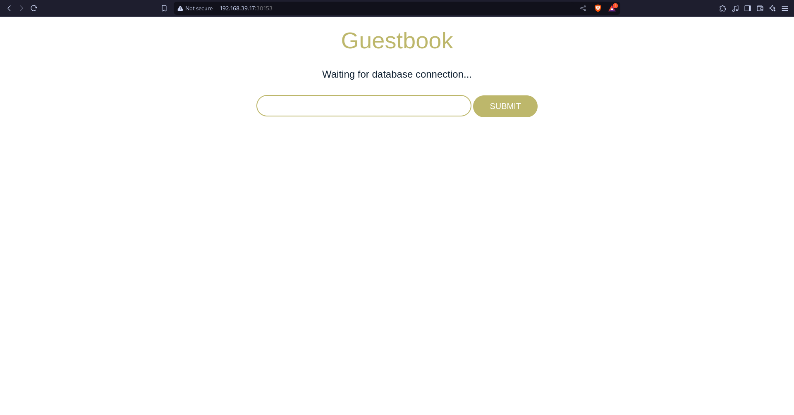

# Taller 4: Trabajando con Services

## Ejercicio 1: Despliegue y acceso de la aplicación GuestBook

Lo que haremos será crear un service el cual correspondera al `GuestBook` que hicimos en el taller anterior para poder acceder a este

### Service Guestbook

El service estará estructurado de la siguiente forma

```yaml
apiVersion: v1
kind: Service
metadata:
  name: guestbook
  labels:
    app: guestbook
    tier: frontend
spec:
  type: NodePort
  ports:
  - port: 80
    targetPort: http
  selector:
    app: guestbook
    tier: frontend
```

Lo ejecutaremos con el siguiente comando

```bash
kubectl apply -f r_service-guestbook.yml
service/guestbook created
```

Podemos comprobar el puerto al que esta asignado con el siguiente comando

```bash
kubectl get services                    

NAME         TYPE        CLUSTER-IP      EXTERNAL-IP   PORT(S)        AGE
guestbook    NodePort    10.110.20.127   <none>        80:30153/TCP   8m41s
kubernetes   ClusterIP   10.96.0.1       <none>        443/TCP        8d
```

Y la ip con el comando

```bash
minikube ip                     
192.168.39.17
```

Como podemos ver esta en el puero 80
Ahora accederemos a la ip del nodo master y el puerto asignado desde el navegador, podremos ver lo siguiente



`Waiting for database connection...` &rarr; Esto lo que nos dice es que esta esperando a conectarse a una base de datos, pero como aun no esta configurada se quedara asi

### Service database

A continuacion creareos el servicio para la base de datos

```yaml
apiVersion: v1
kind: Service
metadata:
  name: redis
  labels:
    app: redis
    tier: backend
spec:
  type: ClusterIP
  ports:
  - port: 6379
    targetPort: redis-server
  selector:
    app: redis
    tier: backend
```


