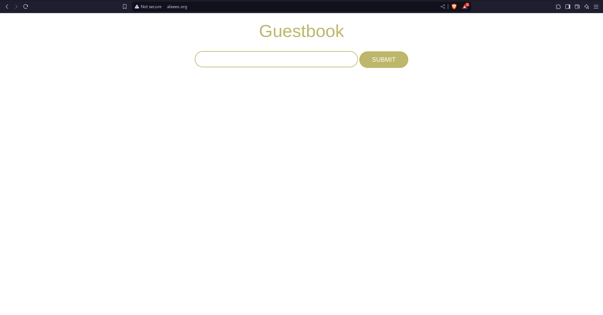

# Taller 4: Trabajando con Services

## Ejercicio 1: Despliegue y acceso de la aplicación GuestBook

Lo que haremos será crear un service el cual correspondera al `GuestBook` que hicimos en el taller anterior para poder acceder a este

### Service Guestbook

El service estará estructurado de la siguiente forma

```yaml
apiVersion: v1
kind: Service
metadata:
  name: guestbook
  labels:
    app: guestbook
    tier: frontend
spec:
  type: NodePort
  ports:
  - port: 80
    targetPort: http
  selector:
    app: guestbook
    tier: frontend
```

Lo ejecutaremos con el siguiente comando

```bash
kubectl apply -f r_service-guestbook.yml
service/guestbook created
```

Podemos comprobar el puerto al que esta asignado con el siguiente comando

```bash
kubectl get services                    

NAME         TYPE        CLUSTER-IP      EXTERNAL-IP   PORT(S)        AGE
guestbook    NodePort    10.110.20.127   <none>        80:30153/TCP   8m41s
kubernetes   ClusterIP   10.96.0.1       <none>        443/TCP        8d
```

Y la ip con el comando

```bash
minikube ip                     
192.168.39.17
```

Como podemos ver esta en el puero 80
Ahora accederemos a la ip del nodo master y el puerto asignado desde el navegador, podremos ver lo siguiente


`Waiting for database connection...` &rarr; Esto lo que nos dice es que esta esperando a conectarse a una base de datos, pero como aun no esta configurada se quedara asi

### Service database

A continuacion creareos el servicio para la base de datos

```yaml
apiVersion: v1
kind: Service
metadata:
  name: redis
  labels:
    app: redis
    tier: backend
spec:
  type: ClusterIP
  ports:
  - port: 6379
    targetPort: redis-server
  selector:
    app: redis
    tier: backend
```

Ahora lo subimos junto con el deploy de redis y la web se debería ver ahora de la siguiente forma


Podemos ver que se conecta correctamente a la base de datos debido a que ya no nos aparece el texto anterior

### Acceso a la aplicación usando Ingress

Primero crearemos el fichero yml

```yml
apiVersion: networking.k8s.io/v1
kind: Ingress
metadata:
  name: guestbook
spec:
  rules:
  - host: www.aleeex.org
    http:
      paths:
      - path: /
        pathType: Prefix
        backend:
          service:
            name: guestbook
            port:
              number: 80
```

Lo iniciamos

```bash
kubectl apply -f r_ingress-guestbook.yml                    
ingress.networking.k8s.io/guestbook created
```

Activamos el addon ingress con el siguiente comando

```bash
minikube addons enable ingress
```

Y en /etc/hosts añadimos la ip y el dominio y ahora probamos a conectarnos



## Ejercicio 2: Despliegue y acceso de la Aplicación Lets-Chat

Primero haremos el deployment de mongo

```yml
apiVersion: apps/v1
kind: Deployment
metadata:
  name: mongo
  labels:
    app: mongo
spec:
  replicas: 1
  selector:
    matchLabels:
      app: mongo
  template:
    metadata:
      labels:
        app: mongo
    spec:
      containers:
      - name: mongo
        image: mongo:4
        ports:
        - containerPort: 27017
        env:
        - name: MONGO_INITDB_ROOT_USERNAME
          value: "admin"
        - name: MONGO_INITDB_ROOT_PASSWORD
          value: "password"

```

Y el service

```yaml
apiVersion: v1
kind: Service
metadata:
  name: mongo
  labels:
    app: mongo
spec:
  ports:
  - port: 27017
    targetPort: 27017
  selector:
    app: mongo
```

Ahora haremos sera crear el deployment de lets-chat

```yml
apiVersion: apps/v1
kind: Deployment
metadata:
  name: lets-chat
  labels:
    app: lets-chat
spec:
  replicas: 2
  selector:
    matchLabels:
      app: lets-chat
  template:
    metadata:
      labels:
        app: lets-chat
    spec:
      containers:
      - name: lets-chat
        image: sdelements/lets-chat
        ports:
        - containerPort: 8080
        env:
        - name: LCB_DATABASE_URI
          value: "mongodb://mongo:27017/letschat"
```

Y el service

```yml
apiVersion: v1
kind: Service
metadata:
  name: lets-chat
  labels:
    app: lets-chat
spec:
  type: NodePort
  ports:
  - port: 8080
    targetPort: 8080
  selector:
    app: lets-chat
```

Por ultimo el ingress

```yml
apiVersion: networking.k8s.io/v1
kind: Ingress
metadata:
  name: lets-chat
spec:
  rules:
  - host: www.chat-aleeex.org
    http:
      paths:
      - path: /
        pathType: Prefix
        backend:
          service:
            name: lets-chat
            port:
              number: 8080
```